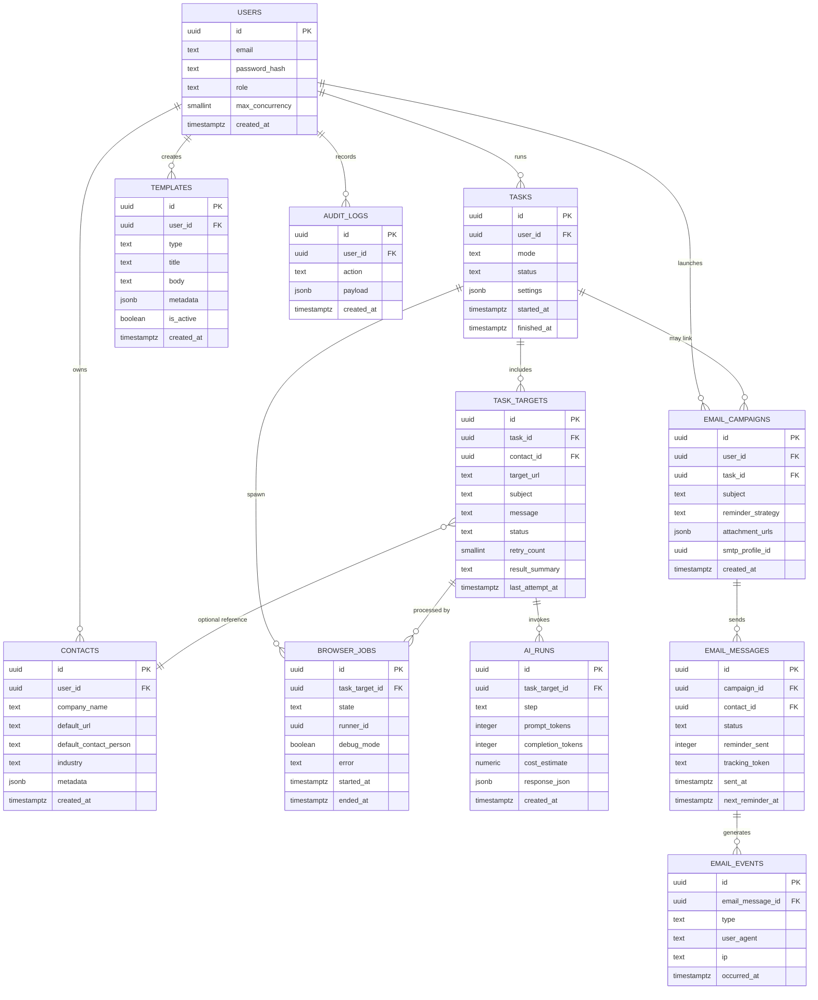

# ER図ドキュメント

このファイルは問い合わせ自動送信ツールの拡張要件に対応するデータベース構成のたたき台です。実装時はここを基にテーブル定義やマイグレーションを設計してください。

## テーブル構成サマリー

- `users`: アカウント・権限・同時実行枠などの管理
- `contacts`: 送信先企業情報のマスタ
- `templates`: 営業文面テンプレート、AI生成結果の保存
- `tasks`: 送信ジョブ（タブやモード単位）
- `task_targets`: ジョブ内の個別URL処理
- `ai_runs`: GPT-5呼び出し履歴
- `browser_jobs`: Playwright実行の同時枠管理
- `email_campaigns` / `email_messages` / `email_events`: 資料送付タブのメール配信・トラッキング
- `audit_logs`: 操作履歴・監査ログ

## ER図（Mermaid）

> 補足: `uuid`型と`jsonb`型はPostgreSQL想定です。他のRDBMSを利用する場合は適宜置き換えてください。

## 関連ドキュメント

- `docs/backend-preparation.md`: マイグレーション・認証・セキュリティ検討の初期メモ

